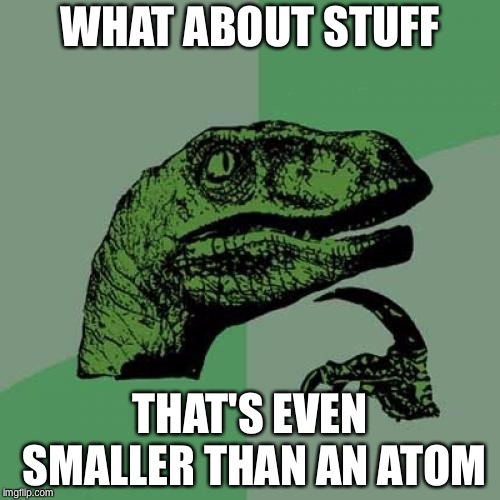
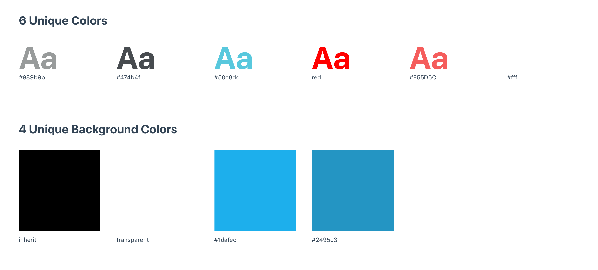
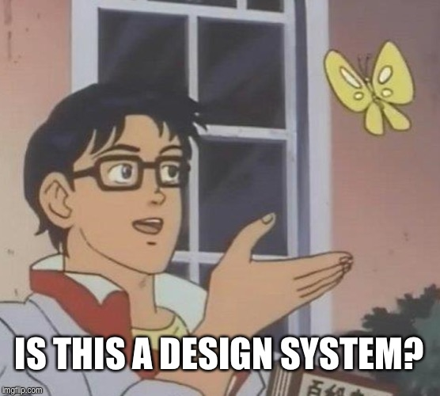

import { Image, Head } from 'mdx-deck'
export theme from '../theme'

<Head><title>Atomic Design</title></Head>

# Design at Scale

---

## Questions from the reading/last week?

---

<Image src='design-system-definition.png' />

---

<Image src='design-system-definition-2.png' />

---

# Atomic Design

---

## Why do we care about Atomic Design?

- Systems are hard to hold in your head at once
- We need ways to thing about systems in smaller parts
- If we make the small bits good, and make the small bits play well with other small bits, we can put those bits together and trust the result

---

## What is Atomic Design?

- [atomicdesign.bradfrost.com](//atomicdesign.bradfrost.com)
- It's just a design methodology that a lot of people (icluding me) like
  - A methodology is a system of methods used in a particular area of study or activity
- It's a way of thinking/reasoning about a certain topic
- It's a starting point to guide our thinking and set the tone of thought
- Ideally, by the end of this program, you will have your own way of thinking

---

<Image src='atomic-design.png' />

---

## Atoms

- The smallest functional units of an interface
- Often, these correspond to individual HTML elements
- Examples:
  - Icon
  - Label
  - Button

---

## Molecules

- Groups of 2+ atoms
- Takes on its own, unique properties
- Examples:
  - `Input + Label + Button = Search Form`
  - `Icon + Label + Checkbox = Filter`

---

## Organisms

- 2+ atoms/molecules/organisms functioning together as a unit
- Form distinct sections of an interface
- Examples:
  - Product grid on Amazon is a collection of product molecules

---

## Templates and Pages

- Further abstractions that build upon atoms, molecules, & organisms
- Templates form a layout and information architecture of a page
- Pages are instances of templates with real data filled in
- Not as useful when building large scale apps
- Great for documents!

---

---

## Particles/Tokens/Primitives/Styles

- Discrete values shared across atomic structures
- Can be used independently or as part of an atom/molecule/organism
- Particles are _always_ stateless and non-functional
- Examples
  - Color
  - Typograhy
  - Space

---

<Image src='atomic-insta.png' size='90%' />

---

## With atomic design thinking in mind...

---

<Image src='aiga.png' />

---

## How might we create a design system for the AIGA Chicago website?

- Things to consider:
  - How would we get **buy in**? (a design system's worst enemy)
  - What would be the scope of our offering?
  - What are the needs of the product/teams that this system would serve?

---

## “Parts” Worksheet

---

## Getting buy in: ask for forgiveness, not permission.

- Determine and document the particles/atoms/molecules/organisms and the rules that govern them
- Apply that work to the actual product by producing reference designs
- Focus on the need, not the want (for now)

---

## How might we determine the particles/atoms/molecules/organisms for the AIGA Chicago website?

- Start by assessing what's there now
- Particles are often tied to CSS very closely
- Use a tool like [CSS Stats](https://cssstats.com)

---

[Check out the full report here.](https://cssstats.com/stats?url=https%3A%2F%2Fchicago.aiga.org&ua=Browser%20Default)

---

## Colors

- 3 neutral colors
  - #474b4f
  - #989b9b
  - #FFFFFF
- 2 red colors
  - red
  - #F55D5C
- 1 blue color
  - #58c8dd

---

## Background Colors

- black
- white
- #1dafec
- #2495c3

---

## Type Sizes

- Gonna have to get our hands dirty
- Go-go-gadget web inspector
- `Option + Command + I`

---

## The only time getting audited is actually a good thing

- Break out into teams of 2
- Each time gets a particular part of the site
- Get your `CMD + Shift + 4` (screenshot) game on

---

## Team Review

- Think about these questions:
  - Is this similar to any other patterns?
  - If so, can they be consolidated?
  - Is this pattern a particle/atom/molecule/etc. and why?
  - Does this pattern even need to exist?

---

## Write EVERYTHING down

- Once things are categorized, document them
- Include things like...
  - the shared name for the thing
  - when to use the thing
  - when _not_ to use the thing
  - how to use the thing

---

---

## Not quite... but it's still heckin' good!

---

## Reference Designs

- Nathan Curtis:

> Don’t skimp and stay too atomic. Use reference designs to build belief in a system’s promise and convince everyone you are headed in a direction worthy of everyone’s invested time and attention.

- Use our new atomic elements to redesign the product

---

## Thanks!
